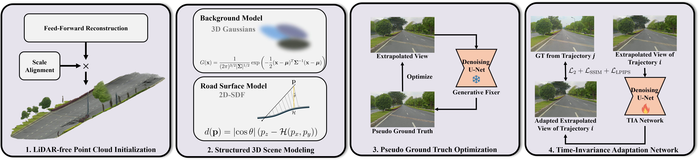
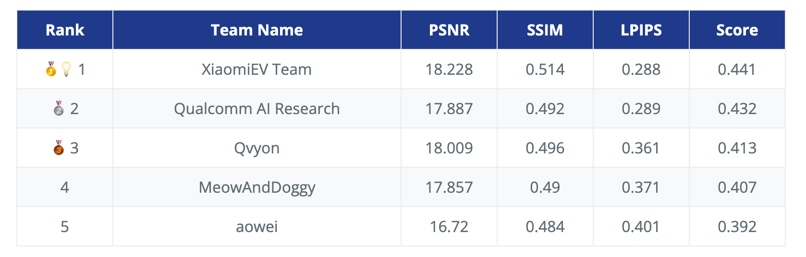

<div align="center">
<h3>ViSE: A Systematic Approach to Vision-Only Street-View Extrapolation</h3>

Kaiyuan Tan, Yingying Shen, Haiyang Sun†, Bing Wang, Guang Chen, Hangjun Ye✉

<strong>Xiaomi EV</strong>

(†) Project leader. (✉)Corresponding Author.

<a href=""></a>
<a href=""></a>
</div>


<!-- ## Introduction -->
## Abstract
Realistic view extrapolation is critical for closed-loop simulation in autonomous driving, yet it remains a significant challenge for current Novel View Synthesis (NVS) methods, which often produce distorted and inconsistent images beyond the original trajectory. This report presents our winning solution, which took first place in the RealADSim Workshop NVS track at ICCV 2025. To address the core challenges of street view extrapolation, we introduce a comprehensive four-stage pipeline. First, we employ a data-driven initialization strategy to generate a robust pseudo-LiDAR point cloud, avoiding local minima. Second, we inject strong geometric priors by modeling the road surface with a novel dimension-reduced SDF termed 2D-SDF. Third, we leverage a generative prior to create pseudo ground truth for extrapolated viewpoints, providing auxiliary supervision. Finally, a data-driven adaptation network removes time-specific artifacts. On the RealADSim-NVS benchmark, our method achieves a final score of 0.441, ranking first among all participants.

## Overview
<div align="center">

</div>

## News
`[2025/09/18]` [🏆champion!] Winner of the RealADSim-NVS Challenge @ ICCV 2025 (https://realadsim.github.io/2025/#award)
<div align="center">

</div>

## Updates
- [x] Release Paper   
- [ ] Release Code 


## Citation
If you find Genesis is useful in your research or applications, please consider giving us a star 🌟 and citing it by the following BibTeX entry.

```bibtex
@article{ViSE2025,
  title={ViSE: A Systematic Approach to Vision-Only Street-View Extrapolation},
  author={Kaiyuan Tan, Yingying Shenm Haiyang Sun, Bing Wang, Guang Chen, Hangjun Ye},
  journal={arXiv},
  year={2025}
}
```
